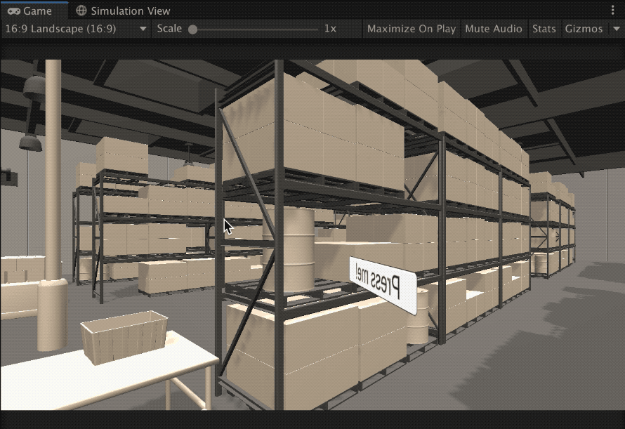
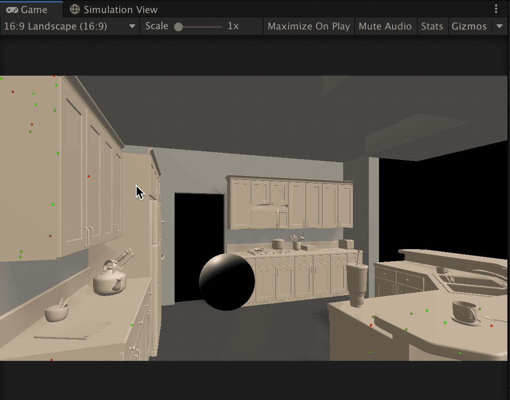

# UnityMARS_WalkthroughStep_Example

  

# 概要
Unity MARS 1.1.1で提供されているテンプレート「Training Factory」を元にして、視界に常にオブジェクトを表示させる方法、コンテンツをステップ別に実行させる方法をまとめたUnitypackageです。   

詳細は以下のUnity Pro Tipsをご参照ください。  

[Unity MARSスターターテンプレートの魅力](https://forpro.unity3d.jp/unity_pro_tips/2020/12/04/1434/)  

# 動作確認環境  

Unity 2019.4.12f1 LTS  
MARS 1.1.1  
MacOSX 10.15.7  
iOS 13.7 (iPhone8, iPad 6th)  
HoloLens2 ()  

# 環境構築の手順 (視界に常にオブジェクトを表示させる方法)

1. Unity2019.4.12f1で新しくプロジェクトを作成する  
2. MARSの購入手続きで取得した「MARS_Installer.unitypackage」をインポートする  
3. GitHubより「ProxyAlignmentForce_example.unitypackage」をダウンロードしてインポートする  
4. iOS/Androidに合わせて、Package ManagerでARKit/ARCore XR Pluginをインストールする  
5. MyProject/ProxyAlignmentForce_exampleシーンを開く   
6. Build Settingで設定してiOS/Android向けにデプロイする、またはUnity Editor上でシーンを実行して、alt+マウス操作でカメラの向きを変える。カメラの向きを変えても、"Press me"ボタンが目の前についてくることを確認する。  
# 環境構築の手順 (コンテンツをステップ別に実行させる方法)

1,2は「視界に常にオブジェクトを表示させる方法」と同一。  
3. GitHubよりWalkthroughExampleStep_Example.unitypackageをダウンロードしてインポートする  
4. XR Pluginをインストールは「視界に常にオブジェクトを表示させる方法」と同一。
5. MyProject/Walkthrough_Exampleシーンを開く   
6. Build Settingで設定してiOS/Android向けにデプロイする、またはUnity Editor上でシーンを実行して、"Press me"ボタンを選択する。選択後、ステップ１から３まで実行されることを確認する。

WalkthroughExampleStep_Example2.unitypackageは、WalkthroughExampleStep_Exampleとほぼ同一です。WalkthroughStepコンポーネントのVisualsを使用してステップごとに表示するオブジェクトを切り替えています。  
